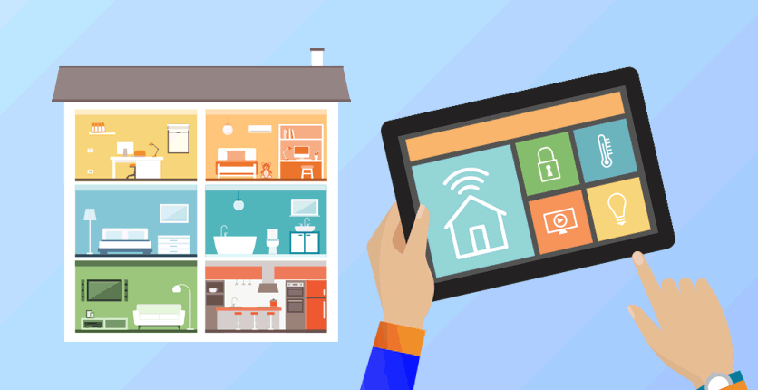
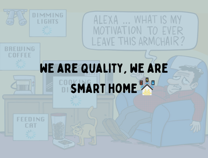

# WEB-FE-HTML-CSS-HW2-EMILYROLDAN

# Smart home 🏠🧑‍💻

<div align="center">
  
</div><br/>

**Smart Home** offers a range of smart devices for your home, offering automation and control over various systems like lighting, security, and appliances, all designed to make your home smarter and more efficient.

## What can you find in Smart Home website? 

- **Customer testimonials🙆:** Read from our satisfied clients about their smart home experiences.
- **How smart home works🏠:** Watch the video to understand how Smart Home technology operates.
- **Devices we offer 💻:** Explore the range of smart devices available for enhancing your home.
- **Tips to achieving a Smart Home🔆:** Get practical advice on integrating and optimizing smart devices in your home.
- **Installation method🔩:** We handle the installation for you!
- **Contact form❓:** Reach out for more details or inquiries about our smart home solutions.


## Build whit


## Getting Started

1. To get a local copy of this repository, clone it using the following command:

```bash
git clone https://github.com/yourusername/your-repository-name.git
```
2. Open index.html in your web browser to view the smart home website.


<div align="center">
  <h2>~ We are quality, We are Smart Home ~</h2>
  
</div><br/>

## ✨ Empower your home with advanced security... Experience the future of Smart Living"  ✨

